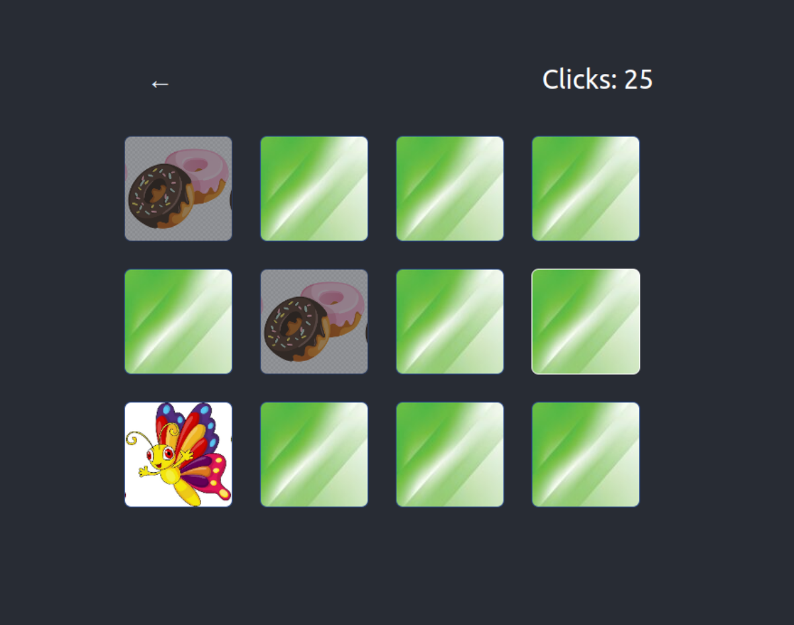

# Memory Game

The Memory Game project was started from scratch, it is a memory game puzzle, the player needs to memorize figures positions and open the matching pair consecutively to solve them.
The game incorporates three deficulty levels, easy, medium and hard.

 [Create React App](https://github.com/facebook/create-react-app).


## Screenshot

  


## Live link
[](https://app.netlify.com/sites/elegant-donut-e8731e/deploys)


## How to use
In your command line terminal run the following commands:

```

git clone https://github.com/Rayan84/memory-game.git
cd memory-game
npm start

```

Open [http://localhost:3000](http://localhost:3000) to view it in your browser.
Runs the app in the development mode.

## Built with

- VScode
- ESLint
- ReactJS
- CSS

## Authors

👤 **Rayan Rassam**

- GitHub: [@Rayan84](https://github.com/Rayan84)
- Twitter: [@Rayan65096267](https://twitter.com/Rayan65096267)
- LinkedIn: [Rayan Rassam](https://www.linkedin.com/in/rayan-rassam/)

## 🤝 Contributing

Contributions, issues, and feature requests are welcome!

Feel free to check the [issues page](../../issues/).

## Show your support

Give a ⭐️ if you like this project!

